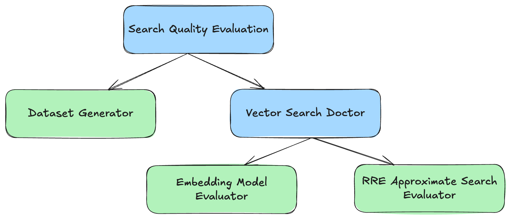

# LLM Search Quality Evaluation Tutorial
Hi there, welcome to our LLM search quality evaluation tutorial!

This tutorial guides you through a complete workflow 
going from relevance-labeled dataset generation to comparing exact and approximate vector search performance evaluations.

There are two parts: the Dataset Generator and the Vector Search Doctor. 
The following diagram illustrates the overall workflow:
<div>
  
</div>


##  What You'll Learn
* How to generate a relevance-labeled dataset for search quality evaluation?
* How to run and evaluate an embedding model with exact vector search?
* How to run an approximate vector search (ANN) and compare its performance against the exact vector search?

## Prerequisites
Before we begin, ensure you have the following tools installed and configured:

* Docker Desktop: We use dockerized Solr instance as a search engine.
  * Install with [docker desktop guide](https://docs.docker.com/desktop/) 
  * Verify with `docker --version`. Docker Desktop includes `docker compose`. 
* uv: Python package installer. This is used to set up the project's virtual environment. 
  * Install with [uv install guide](https://docs.astral.sh/uv/getting-started/installation/#standalone-installer)
* For running our third tool, we need  [Java](https://www.java.com/) and 
[Maven](https://maven.apache.org/), so make sure both are installed in your machine.
* Git LFS: we use it for storing large datasets in GitHub
  * Install with: [git lfs](https://git-lfs.com/)


## Get Started
Now that you have the prerequisites installed, let's get the projects set up and running search quality evaluation.

What we do next:
* Set up LLM Search Quality Evaluation & Tutorial Projects
* Run Solr and Index Documents
* Run Dataset Generator for relevance dataset creation
* Run Embedding Model Evaluator for exact vector search performance
* Run Approximate Search Evaluator for ANN search performance

-------
### Set up LLM Search Quality Evaluation & Tutorial Projects

There are 2 repos that we need to clone:
* [LLM Search Quality Evaluation Tutorial](https://github.com/SeaseLtd/llm-search-quality-evaluation-tutorial)
* [LLM Search Quality Evaluation](https://github.com/SeaseLtd/llm-search-quality-evaluation)

Firstly, clone this [llm-search-quality-evaluation-tutorial](https://github.com/SeaseLtd/llm-search-quality-evaluation-tutorial) repo:
```bash
git clone git@github.com:SeaseLtd/llm-search-quality-evaluation-tutorial.git
```

Secondly, clone this [llm-search-quality-evaluation](https://github.com/SeaseLtd/llm-search-quality-evaluation) repo:
```bash
git clone git@github.com:SeaseLtd/llm-search-quality-evaluation.git

cd llm-search-quality-evaluation
```

We use `uv` to create a virtual environment in the project and install all the required packages:
```bash
uv sync
```
----

### Run Solr and Index Documents

We use Solr and run dockerized Solr locally in this tutorial. There is a [docker-services](docker-services) folder. 
We will be using a sub-folder [solr-init](docker-services/solr-init) inside the docker-services where you can find 
[large dataset](docker-services/solr-init/data/dataset.json), 
[Dockerfile](docker-services/solr-init/Dockerfile), and [solr_init.py](docker-services/solr-init/solr_init.py). 

In addition to running Solr instance, we need to index some documents for the actual search quality evaluation. 
We will use [large dataset](docker-services/solr-init/data/dataset.json) (`dataset.json`).
The dataset comes from BBC news, and it contains around ~100k docs. As it's big, we use Git LFS to store in GitHub.

If you want to see the content of the large dataset file, run the following  commands 
from the `llm-search-quality-evaluation-tutorial` repo: 
```bash
llm-search-quality-evaluation-tutorial$ git lfs install
llm-search-quality-evaluation-tutorial$ git lfs pull
```

Next, run Solr (can be reached at http://localhost:8983/solr) and  index the large dataset
from the `llm-search-quality-evaluation-tutorial` repo::
```bash
llm-search-quality-evaluation-tutorial$ cd docker-services

docker-services$ docker compose -f docker-compose.solr.yml up --build
```
----

### Run Dataset Generator

So now it's the core of the project, make sure you are in the [LLM Search Quality Evaluation](https://github.com/SeaseLtd/llm-search-quality-evaluation) repo.

Dataset Generator is a CLI tool to generate relevance dataset for search evaluation. It retrieves documents from search engine, 
generates synthetic queries, and scores the relevance of document-query pairs using LLMs.

Before running, we need to set up a configuration file.
* See [dataset_generator_config.yaml](https://github.com/SeaseLtd/llm-search-quality-evaluation/blob/main/examples/configs/dataset_generator/dataset_generator_config.yaml)
* For detailed configuration info, see the [README](https://github.com/SeaseLtd/llm-search-quality-evaluation/blob/main/src/llm_search_quality_evaluation/dataset_generator/README.md)

Before running the dataset generator, we need to either set up a LLM configuration file 
(e.g. provide LLM model API key, add `.env` file with `OPENAI_API_KEY`)

or use our [tmp datastore](datastore.json) where the LLM generated queries and ratings are stored for the sake of time.

We need to copy the datastore from `llm-search-quality-evaluation-tutorial` repo to `llm-search-quality-evaluation` repo:

Either copy+paste or run the command below by substituting `$absPath`:

```bash
cp $absPath/llm-search-quality-evaluation-tutorial/datastore.json  ./resources/tmp
```

To run the dataset generator:
```bash
uv run dataset_generator --config examples/configs/dataset_generator/dataset_generator_config.yaml
```

This produces a relevance dataset file under `resources` dir which will be used in the next modules.


To know more about all the possible CLI parameters:
```bash
uv run dataset_generator --help
```

-----
### Run Embedding Model Evaluator

This tool is an MTEB benchmarking extension designed to evaluate embedding models on custom dataset, with a focus on retrieval and reranking tasks.
It assesses model quality by using an exact vector search to establish a "ground truth" for retrieval performance on custom dataset.

Before running, we need to set up a configuration file.
* See [embedding_model_evaluator_config.yaml](https://github.com/SeaseLtd/llm-search-quality-evaluation/blob/main/examples/configs/vector_search_doctor/embedding_model_evaluator/embedding_model_evaluator_config.yaml) for an example.
* For detailed configuration info, see the [README](https://github.com/SeaseLtd/llm-search-quality-evaluation/blob/main/src/llm_search_quality_evaluation/vector_search_doctor/embedding_model_evaluator/README.md).

To run the embedding model evaluator:

```bash
uv run embedding_model_evaluator --config examples/configs/vector_search_doctor/embedding_model_evaluator/embedding_model_evaluator_config.yaml
```

This outputs task evaluation result and relevance dataset embeddings (document and query embeddings). 
The embeddings are saved to `resources/embeddings` dir which will be used in the next module.

We will copy these embeddings to the `llm-search-quality-evaluation-tutorial` repo so that 
we will re-index the dataset with the doc embeddings in Solr.

Either copy+paste or run the command below by substituting `$absPath`:

```bash
cp ./resources/embeddings/documents_embeddings.jsonl  $absPath/llm-search-quality-evaluation-tutorial/embeddings/documents_embeddings.jsonl
```

Then, we can re-index the document embeddings to Solr from the `llm-search-quality-evaluation-tutorial` repo:

```bash
llm-search-quality-evaluation-tutorial$ cd docker-services

docker-services$ docker compose -f docker-compose.solr.yml run --rm -e FORCE_REINDEX=true solr-init
```

----
### Run Approximate Search Evaluator
This module tests ANN (approximate nearest neighbour) vector search used by the collection enriched with embeddings
from the search engine.


Second, we need the relevance dataset with RRE format for this module. We run the Dataset Generator
with `output_format=RRE`. Update the dataset generator config file and re-run:
```bash
uv run dataset_generator --config examples/configs/dataset_generator/dataset_generator_config.yaml
```

Once we have the relevance dataset (`ratings.json`) file, we set up a configuration file for this approximate search evaluator.
* See [approximate_search_evaluator_config.yaml](https://github.com/SeaseLtd/llm-search-quality-evaluation/blob/main/examples/configs/vector_search_doctor/approximate_search_evaluator/approximate_search_evaluator_config.yaml) for an example.
* For detailed configuration info, see the [README](https://github.com/SeaseLtd/llm-search-quality-evaluation/blob/main/src/llm_search_quality_evaluation/vector_search_doctor/approximate_search_evaluator/README.md).

Note: [Sease's RRE](https://github.com/SeaseLtd/rated-ranking-evaluator/) Maven archetype must be exposed to be found by your 
local machine. This is done by following the Step 1 in the
[guide in RRE Wiki](https://github.com/SeaseLtd/rated-ranking-evaluator/wiki/Maven%20Archetype).

Now we can run the approximate search evaluator:

```bash
uv run approximate_search_evaluator --config examples/configs/vector_search_doctor/approximate_search_evaluator/approximate_search_evaluator_config.yaml
```
This outputs approximate vector search evaluation result which can compared to the previous exact vector search result.

